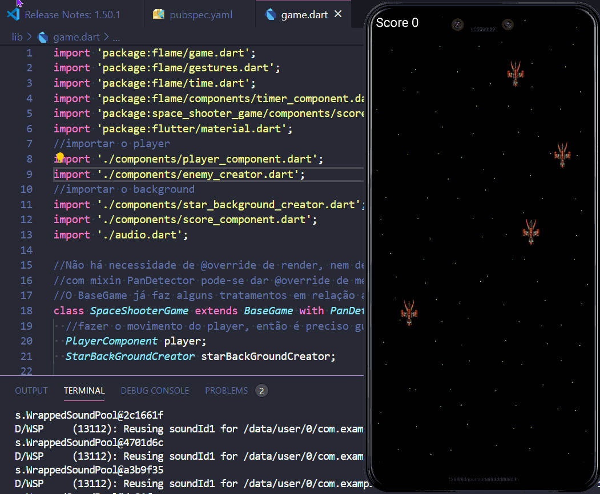

# space_shooter_game

A simple Space Shooter game made in flutter with Flame Engine.
The game has sound and scores the number of enemies destroyed until any ship collision.

Credits to Erick who made this amazing tutorial: https://www.youtube.com/watch?v=MEDYxldSoDI
Erick is also the co-creator of Flame engine. Thank you!

Game Assets:
The music and explosion can be found here:
- https://opengameart.org/content/explosion-8
- https://files.freemusicarchive.org/storage-freemusicarchive-org/music/Section_27/Organism/S27-X_II/Organism_-_19_-_Space_Funk.mp3

The game sprites(explosion, ship) can be found below and the star parallax background were made in paint.
- https://elthen.itch.io/

